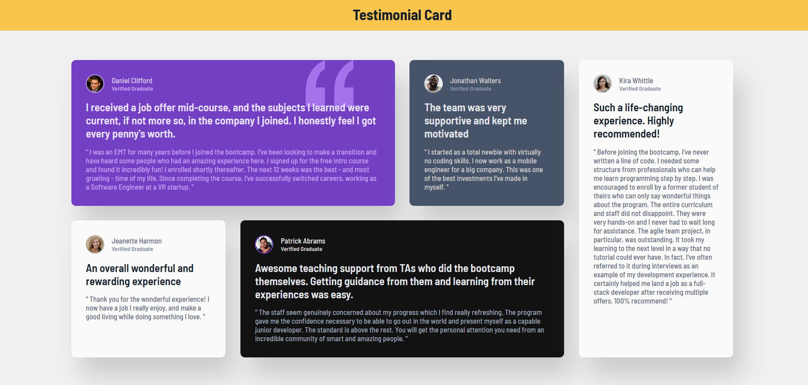

# Frontend Mentor - Testimonials grid section solution

This is a solution to the [Testimonials grid section challenge on Frontend Mentor](https://www.frontendmentor.io/challenges/testimonials-grid-section-Nnw6J7Un7). Frontend Mentor challenges help you improve your coding skills by building realistic projects.

## Table of contents

- [Overview](#overview)
  - [The challenge](#the-challenge)
  - [Screenshot](#screenshot)
  - [Links](#links)
- [My process](#my-process)
  - [Built with](#built-with)
  - [What I learned](#what-i-learned)
- [Author] (#author)
- [Acknowledgments] (#acknowledgments)

**Note: Delete this note and update the table of contents based on what sections you keep.**

## Overview

### The challenge

Users should be able to:

- View the optimal layout for the site depending on their device's screen size

### Screenshot




### Links

- Solution URL: [http://127.0.0.1:3000/Basics%20HTML%20&%20CSS/Testimonials-Grid-Section-Main/testimonials-grid-section-main/index.html?vscode-livepreview=true]
- Live Site URL: [https://cheery-fox-f5feb1.netlify.app/]

## My process

### Built with

- Semantic HTML5 markup
- Flexbox
- CSS Grid
- Mobile-first workflow

### What I learned

In this project, I have learnt to design layouts using CSS Grid. Additionally, I have also learnt to use media queries effectively for different screen sizes.

```css
.proud-of-this-css {
    .testimonial-container {
        width: 90%;
        display: grid;
        grid-template-columns: repeat(3, 1fr);
        grid-template-rows: auto;
    }
}

## Author

- GitHub - [Biru Basfore](https://github.com/BiruMJ)
- Frontend Mentor - [@BiruMJ](https://www.frontendmentor.io/profile/BiruMJ)
- LinkedIn - [@biru-basfore-8b52262a4](www.linkedin.com/in/biru-basfore-8b52262a4)

## Acknowledgments

- I have just tried to practice my css grid skills which I have learnt from one of my enrolled courses on Scrimba. 
Best of luck!
